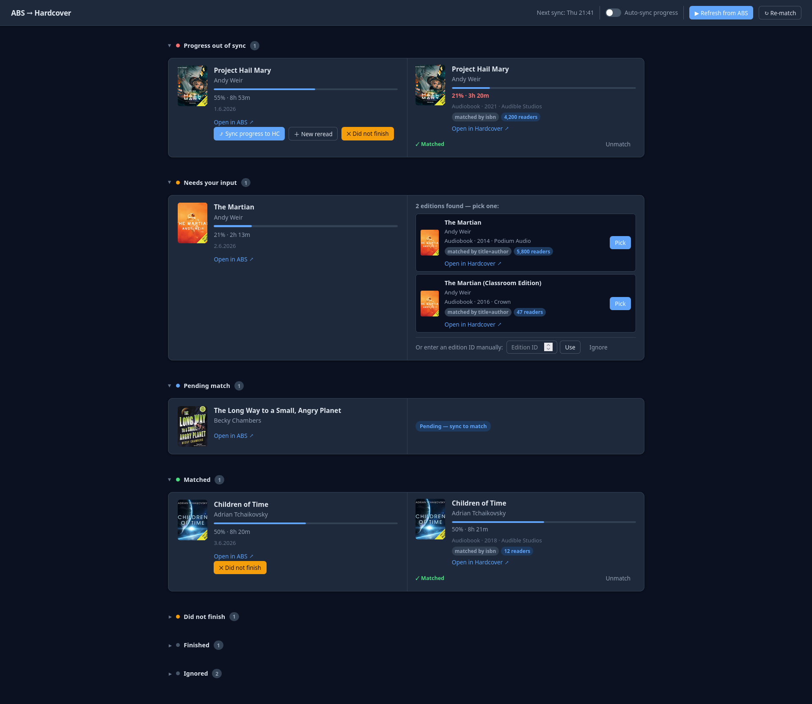
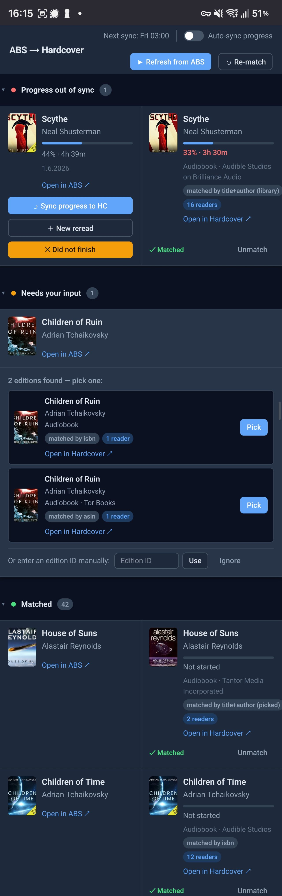

# audiobookshelf-hardcover-sync

A small self-hosted web app that mirrors your **Audiobookshelf** (ABS) listening
progress onto **Hardcover** — it matches each ABS audiobook to a Hardcover
edition, shows them side by side, and keeps your reading progress and status in
sync (manually per book, or automatically on a schedule).

> Built almost entirely with **Claude** (Anthropic's Claude Code). Claude was
> essential to the result — the design, the Go/HTMX implementation, the Hardcover
> API spelunking, and the many fixes and UI iterations were all done in
> collaboration with it.

Improving on these two projects:
- https://github.com/rohit-purandare/ShelfBridge
- https://github.com/drallgood/audiobookshelf-hardcover-sync

---

## Screenshots

**Desktop**



<details>
<summary><strong>Mobile</strong></summary>



</details>

---

## How it works

Each book is a row with two halves:

- **Left — Audiobookshelf:** cover, title, author, your listening progress, start/
  finish dates, and a link back to ABS. When a book needs attention, its action
  buttons live here too.
- **Right — Hardcover:** the matched edition (cover, title, how it was matched,
  reader count, link to Hardcover) — or the matching UI when it isn't matched yet.

Books are grouped into categories, shown in this order:

| Category | What it means |
|---|---|
| **Progress out of sync** | Matched, but your ABS progress has drifted from Hardcover. Shows the per-book action buttons. |
| **Needs your input** | Searched Hardcover and found several candidate editions — pick the right one (or paste an edition ID). |
| **Pending match** | Pulled from ABS, not yet searched on Hardcover. |
| **Matched** | Confirmed edition, progress in sync. Ordered by most recently listened to, then by date added. |
| **Did not finish** | Marked "Did not finish" on Hardcover. |
| **Finished** | Finished on both ABS and Hardcover. |
| **Ignored** | Explicitly ignored; won't be matched. Can be un-ignored. |

### Matching

For each unmatched book the app tries, in order:

1. **Your existing Hardcover library** — by ISBN, then ASIN, then title+author.
2. **The Hardcover catalog** — search by ISBN → ASIN → title+author.

A single hit auto-matches; several become **candidates** to pick from (each shows
how it was found and how many Hardcover readers it has); none leaves the book in
*Pending* with a manual "paste an edition ID" option. The app prefers the
**audiobook** edition of a matched book, since ABS is audiobook-centric.

> It never creates new books on Hardcover — it only attaches to editions that
> already exist there.

### Progress sync

Pushing progress writes it in the unit the matched edition uses:

- **Audiobook editions** → `progress_seconds` (your ABS position).
- **Physical/ebook editions** (no audio length) → `progress_pages`, scaled from
  how far through the audiobook you are × the edition's page count. (Some books
  only exist as print on Hardcover; this keeps the percentage meaningful.)

Status is set from ABS: in progress → *Currently Reading*, finished → *Read*.

### Per-book actions

On out-of-sync books (left side):

- **Sync progress to HC** — update the latest Hardcover read with your current ABS progress.
- **New reread** — start a brand-new Hardcover reading session at the current progress.
- **Did not finish** — mark the book DNF on Hardcover (for books you're not going to finish).

### Auto-sync toggle

A switch in the header — **Auto-sync progress** — controls whether the scheduled
run also pushes progress. When **on**, each cron run (after pulling from ABS and
re-reading Hardcover) automatically syncs every book in *Progress out of sync*.
When **off**, the schedule only refreshes/matches and you sync each book by hand.

### When it runs

- **Manually:** **Refresh from ABS** (pull library + progress, match new books)
  and **Re-match** (re-run matching for un-matched/un-ignored books).
- **On a schedule:** the cron job (`CRON_SCHEDULE`) does Refresh → Match →
  re-read Hardcover progress → optional auto-sync.

---

## Using it

Single-user: one ABS account, one Hardcover account. Put the values in a `.env`
file next to `docker-compose.yml` (see `.env.example`).

### 1. Run

add to your docker-compose.yml:

```yaml
services:
  abs-sync:
    image: ghcr.io/michondr/audiobookshelf-hardcover-sync:latest
    container_name: abs-sync
    restart: unless-stopped
    ports:
      - "8080:8080"
    environment:
      ABS_URL: http://audiobookshelf
      ABS_TOKEN: your-abs-token
      HARDCOVER_TOKEN: your-hardcover-token
      CRON_SCHEDULE: ${CRON_SCHEDULE:-0 3 * * *}
      CRON_TIMEZONE: ${CRON_TIMEZONE:-Europe/Prague}
      DB_PATH: /data/app.db
      PORT: 8080
    volumes:
      - ./.data:/data
#    healthcheck:  #can be omitted, is present in the built image
#      test: ["CMD", "wget", "-q", "-O", "/dev/null", "http://localhost:8080/healthz"]
#      interval: 30s
#      timeout: 5s
#      start_period: 10s
#      retries: 3
```


### 2. First use

1. Open the app and hit **Refresh from ABS** to import your library and progress.
2. Matching runs in the background — refresh the page after a moment.
3. Resolve anything under **Needs your input** (pick an edition) or **Pending match**.
4. Sync progress per book, or flip on **Auto-sync progress** to have the schedule do it.

---

## Stack

- **Language:** Go
- **UI:** HTMX + [templ](https://templ.guide) (pure Go, no JS build step)
- **Storage:** SQLite (via `modernc.org/sqlite`, CGO-free)
- **Deploy:** Docker / Docker Compose

---

## API reference

### Audiobookshelf REST API

Base URL: `$ABS_URL`, auth: `Authorization: Bearer {ABS_TOKEN}`

| Endpoint | Purpose |
|---|---|
| `GET /api/libraries` | List libraries |
| `GET /api/libraries/{id}/items` | All books |
| `GET /api/me/progress/{itemId}` | Progress for a book |
| `GET /api/me/items-in-progress` | All in-progress books |

Key progress fields: `currentTime` (seconds), `progress` (0–1), `isFinished`,
`startedAt`, `finishedAt`, `lastUpdate`. Covers are auth-only, so the app proxies
them at `GET /proxy/abs-cover/{itemId}`.

### Hardcover GraphQL API

Endpoint: `https://api.hardcover.app/v1/graphql`, auth: `Authorization: Bearer {HARDCOVER_TOKEN}`

| Operation | Purpose |
|---|---|
| `insert_user_book` | Add a book to your library (`book_id`, `edition_id`, `status_id`) |
| `insert_user_book_read` | Start a reading session / reread |
| `update_user_book_read` | Update a session's `progress_seconds` / `progress_pages` / `finished_at` |
| `update_user_book` | Change status (`status_id`) |

Status IDs: `1` Want to Read · `2` Currently Reading · `3` Read · `5` Did Not Finish.
Reading-format IDs: `2` Audiobook · `4` Ebook.

> ⚠️ `user_books` is **globally readable** — every query against it must filter by
> the current `user_id`, or it returns other users' shelves.
